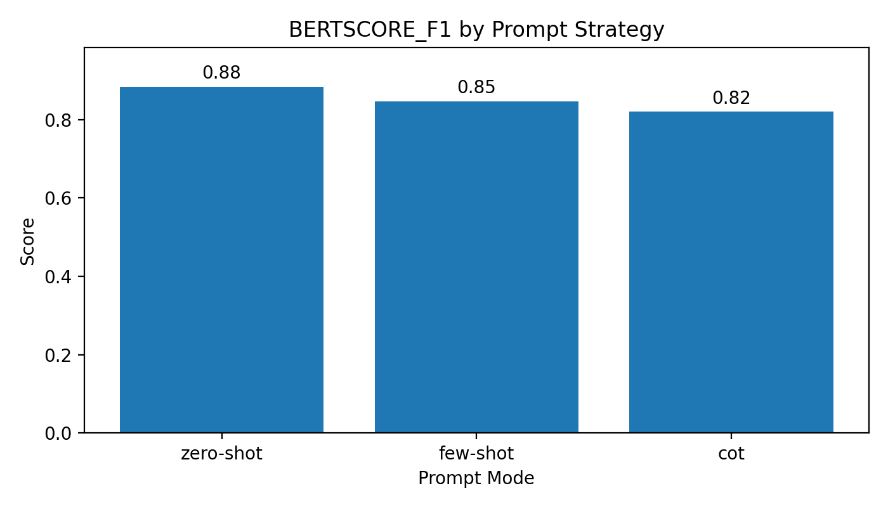
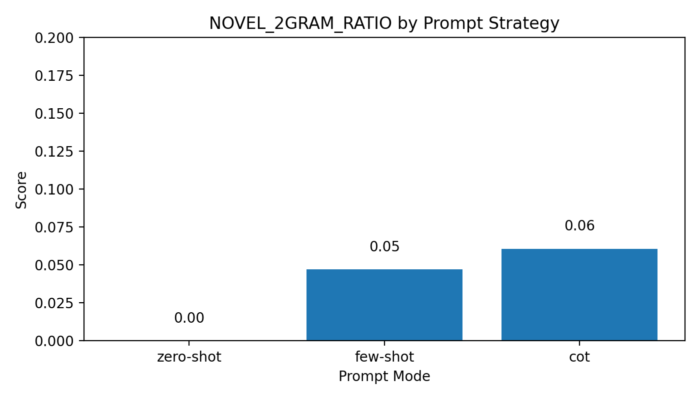
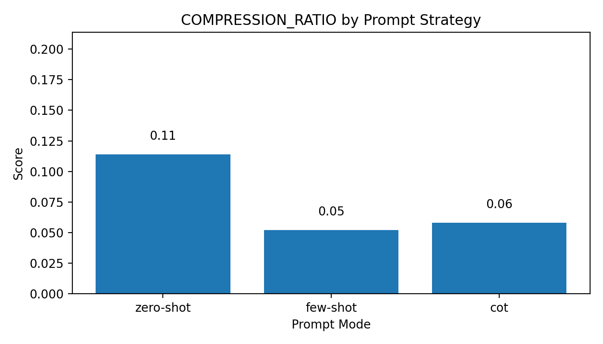
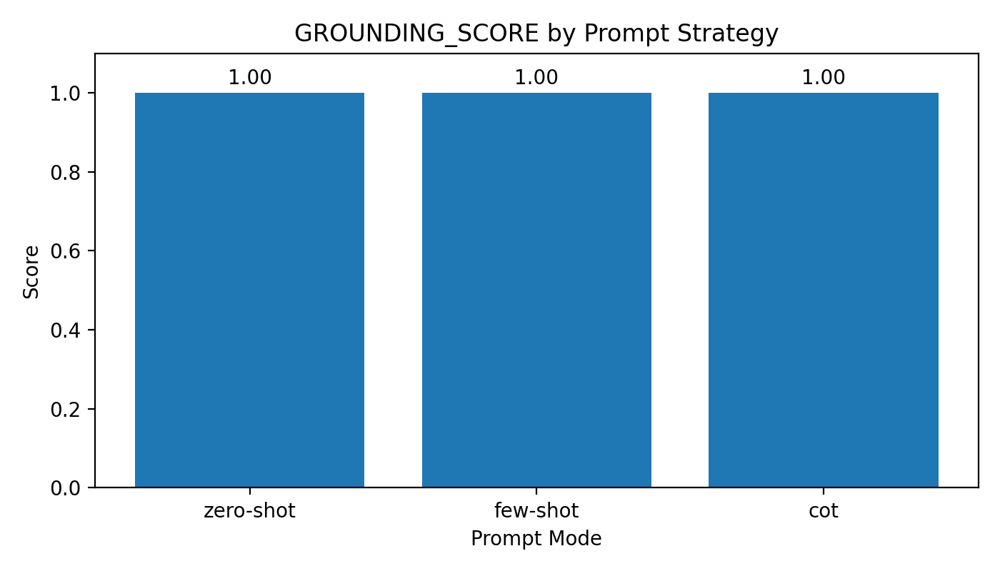
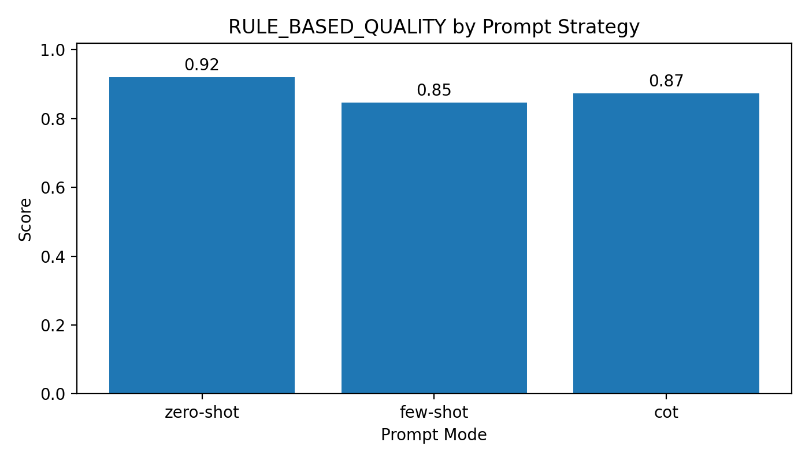

# Kaggle Prompt Engineering Results Summary

## Executive Summary

This result package documents a prompt engineering test built on the Kaggle dataset [`everydaycodings/global-news-dataset`](https://www.kaggle.com/datasets/everydaycodings/global-news-dataset). The repository evaluates summaries with semantic and rule-based metrics centered on BERTScore and deterministic diagnostics.

For the benchmark run completed in this workspace, the project used:

- 24 randomly sampled news records
- seed `18431092`
- `description` as a weak reference-summary proxy
- the repository's `zero-shot`, `few-shot`, and `cot` prompt modes
- the local `mock` backend for reproducible generation
- BERTScore plus rule-based diagnostics for evaluation

The main result is that `zero-shot` remained the strongest overall mode on both semantic similarity and the composite rule-based quality score.

| Prompt mode | BERTScore F1 | Novel 2-gram Ratio | Compression Ratio | Grounding Score | Rule-Based Quality |
| --- | ---: | ---: | ---: | ---: | ---: |
| `zero-shot` | 0.8840 | 0.0000 | 0.1138 | 1.0000 | 0.9198 |
| `few-shot` | 0.8466 | 0.0470 | 0.0520 | 1.0000 | 0.8469 |
| `cot` | 0.8197 | 0.0607 | 0.0580 | 1.0000 | 0.8742 |

## Evaluation Design

The evaluation stack now combines one semantic metric family with several deterministic diagnostics:

- `BERTScore`: semantic similarity between the generated summary and the reference summary
- `Novel n-gram ratio`: how much of the summary wording is not copied directly from the source article
- `Compression ratio`: summary length divided by article length
- `Grounding score`: whether numbers and capitalized entity spans in the summary also appear in the source article
- `Rule-based quality`: average of grounding, non-redundancy, and heuristic length fitness

This Kaggle dataset still does not provide gold-standard human summaries for every article, so the benchmark remains a weak-supervision setup:

- `full_content` or `content` is used as the article body
- `description` is used as the reference summary

That means BERTScore here should be interpreted as a comparative signal across prompt strategies, not as a publication-grade absolute quality score.

## Key Findings

- `zero-shot` achieved the highest `bertscore_f1` at `0.8840`.
- `zero-shot` also achieved the highest `rule_based_quality` at `0.9198`.
- `few-shot` produced the shortest summaries with the lowest `compression_ratio`, but that extra compression reduced semantic similarity.
- `cot` generated the most novel phrasing, reflected in the highest `novel_2gram_ratio`, but still trailed on semantic alignment.
- All three modes received a perfect `grounding_score` in this run because the mock generator stayed tightly extractive and did not introduce unsupported entities or numbers.

Article-level wins:

- Best `bertscore_f1`: `zero-shot` 20 / 24, `cot` 3 / 24, `few-shot` 1 / 24
- Best `rule_based_quality`: `zero-shot` 18 / 24, `cot` 5 / 24, `few-shot` 1 / 24

## Interpretation

These results support a consistent reading of the current pipeline:

- `zero-shot` works best because the mock summarizer largely preserves lead information, and the Kaggle `description` field is usually close to a lead-style abstract.
- `few-shot` becomes too compressed under the current mock logic, which hurts both BERTScore and the heuristic length-fit score.
- `cot` introduces more reordering and abstraction, which slightly improves novelty but reduces similarity to the reference-summary proxy.

The novelty and compression metrics are useful here because they explain *why* a mode underperforms instead of only saying that it does:

- low novelty plus strong BERTScore suggests extractive alignment
- higher novelty plus lower BERTScore suggests the summary drifted away from the proxy reference wording
- overly small compression ratios suggest over-compression

## Charts







## Project Code

The key files supporting this updated evaluation pipeline are:

- `prepare_kaggle_dataset.py`: builds a random Kaggle sample in the experiment JSON format
- `run_experiments.py`: runs prompt-mode experiments and records the new metric set
- `evaluate.py`: computes BERTScore, novelty, compression, and rule-based diagnostics
- `plot_results.py`: generates charts for the current metric suite
- `README.md`: documents the lower-cost workflow and multi-backend support

Reproduction commands:

```bash
python3 prepare_kaggle_dataset.py \
  --output result/kaggle_sample_dataset.json

python3 run_experiments.py \
  --dataset result/kaggle_sample_dataset.json \
  --output result/kaggle_mock_results.json \
  --backend mock \
  --modes zero-shot few-shot cot

MPLCONFIGDIR=/tmp/matplotlib python3 plot_results.py \
  --results result/kaggle_mock_results.json \
  --output-dir result/charts
```

## Conclusions

Within the current repository design, `zero-shot` remains the strongest reproducible baseline. BERTScore plus deterministic diagnostics makes the results more interpretable:

- semantic alignment is measured more robustly than exact word overlap
- novelty and compression reveal how aggressive each prompt style is
- rule-based checks provide a lightweight quality screen without paying for judge-model calls

The next strong upgrade would be to rerun the same 24-article workflow with one real LLM backend such as Gemini, DeepSeek, or Claude and compare whether the relative ranking stays stable under semantic evaluation.

## Result Folder Contents

- `kaggle_sample_dataset.json`: the sampled Kaggle dataset used in the run
- `kaggle_mock_results.json`: per-article outputs and aggregate metrics
- `charts/`: metric comparison figures
- `current_model_spot_check.md`: qualitative manual comparison using the current assistant model
