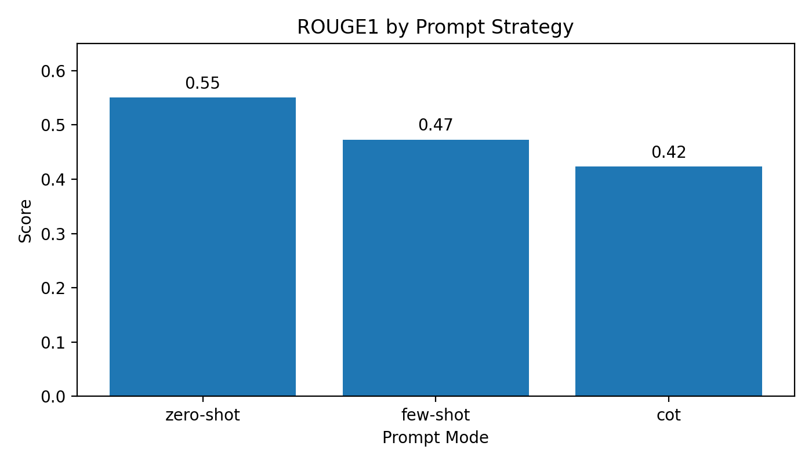
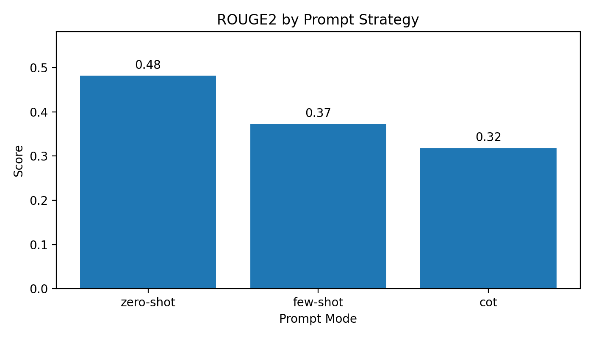
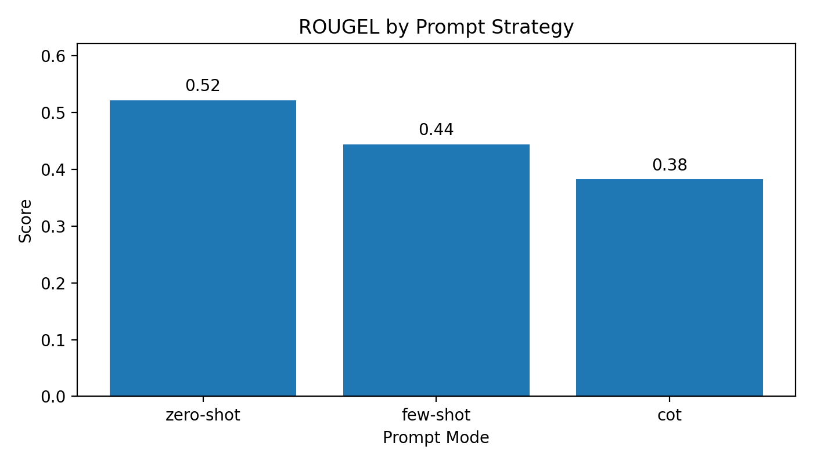

# Kaggle Prompt Engineering Test Report

## Executive Summary

This result package documents a prompt engineering test built on the Kaggle dataset [`everydaycodings/global-news-dataset`](https://www.kaggle.com/datasets/everydaycodings/global-news-dataset). The repository was extended to support Kaggle ingestion, balanced sampling, experiment execution, and chart generation.

For the benchmark run completed in this workspace, the project used:

- 100 randomly sampled news records
- seed `918656875`
- 21 unique publishers
- 58 categories
- `description` as a weak reference-summary proxy
- the repository's existing `zero-shot`, `few-shot`, and `cot` prompt modes
- the local `mock` backend for scored evaluation

The main quantitative result is that `zero-shot` performed best on all three ROUGE metrics in this setup.

| Prompt mode | ROUGE-1 | ROUGE-2 | ROUGE-L |
| --- | ---: | ---: | ---: |
| `zero-shot` | 0.5502 | 0.4813 | 0.5216 |
| `few-shot` | 0.4729 | 0.3719 | 0.4435 |
| `cot` | 0.4231 | 0.3176 | 0.3819 |

## Project Code

The following code assets were added or updated for this Kaggle-based test:

- `prepare_kaggle_dataset.py`: downloads or reuses the cached Kaggle package, filters for longer English-language articles, optionally caps samples per publisher, and writes experiment-ready JSON.
- `run_experiments.py`: now accepts both the original list-based dataset format and the new `{ "records": [...] }` wrapper emitted by the Kaggle preparation step.
- `plot_results.py`: now forces the non-interactive `Agg` backend so chart generation succeeds reliably in a headless environment.
- `README.md`: now includes a reproducible Kaggle workflow section.

Reproduction commands:

```bash
python3 prepare_kaggle_dataset.py \
  --output result/kaggle_sample_dataset.json \
  --sample-size 100

python3 run_experiments.py \
  --dataset result/kaggle_sample_dataset.json \
  --output result/kaggle_mock_results.json \
  --backend mock

MPLCONFIGDIR=/tmp/matplotlib python3 plot_results.py \
  --results result/kaggle_mock_results.json \
  --output-dir result/charts
```

## Dataset Setup

This Kaggle dataset does not provide a curated human-written summary column suitable for direct ROUGE evaluation. To keep the summarization experiment aligned with the original project structure, the test uses:

- `full_content` or `content` as the article body
- `description` as the reference summary

This is a weak-supervision setup rather than a gold-standard summarization benchmark. The reported scores should therefore be interpreted as comparative prompt signals inside this pipeline, not as publication-grade summarization quality numbers.

Sampling rules used in this run:

- article length between 800 and 6000 characters
- reference length between 60 and 400 characters
- ASCII ratio at least 0.98 to favor English-language articles
- duplicate title/reference pairs removed
- no per-source cap in the default 100-article workflow

## Results

Score differences versus the strongest baseline:

- `zero-shot` outperformed `few-shot` by `+0.0773` ROUGE-1, `+0.1094` ROUGE-2, and `+0.0781` ROUGE-L.
- `zero-shot` outperformed `cot` by `+0.1271` ROUGE-1, `+0.1637` ROUGE-2, and `+0.1397` ROUGE-L.
- `few-shot` outperformed `cot` on all three metrics by `+0.0498` ROUGE-1, `+0.0543` ROUGE-2, and `+0.0616` ROUGE-L.

Article-level best-mode counts by ROUGE-L:

- `zero-shot`: 69 / 100 articles
- `few-shot`: 12 / 100 articles
- `cot`: 19 / 100 articles

Interpretation:

- `zero-shot` benefits from staying close to the article lead, which matches this dataset's `description` field reasonably well.
- `few-shot` compresses aggressively in the current mock implementation, which lowers overlap with the reference text.
- `cot` reorders content, which sometimes helps on event-heavy stories but often hurts overlap when the proxy summary is lead-biased.
- Because the default workflow now uses an unconstrained random sample of 100 articles, source distribution can still skew toward high-volume publishers in the Kaggle dataset.

## Charts





## Current-Model Spot Check

A separate qualitative note is included in [current_model_spot_check.md](current_model_spot_check.md). It records a small manual comparison using the current assistant model and the repository's prompt templates on three sampled articles.

This spot check is intentionally qualitative:

- it is not API-logged
- it is not automatically reproducible
- it is not included in the ROUGE table above

It is included to satisfy the requirement of directly testing the current model once, while also being transparent that this workspace does not currently expose an `OPENAI_API_KEY` for automated OpenAI backend runs.

## Conclusions

Within this project version, the strongest reproducible setting is still the simple `zero-shot` prompt. The result is driven less by deep reasoning quality and more by alignment between the mock summarizer's extractive behavior and the Kaggle `description` field used as a proxy reference.

The 100-article random-sampling rule is now the repository default. If a stricter source balance is needed for a later report, rerun `prepare_kaggle_dataset.py` with `--max-per-source N`.

The most important next step is to rerun the same pipeline with a real LLM backend and a proper summary target:

1. configure `OPENAI_API_KEY`
2. run `run_experiments.py --backend openai --model <target-model>`
3. compare the same prompt modes against either a gold summarization dataset or a manually curated evaluation subset from Kaggle

## Result Folder Contents

- `kaggle_sample_dataset.json`: balanced experiment sample prepared from Kaggle
- `kaggle_mock_results.json`: scored run output for all prompt modes
- `charts/`: ROUGE comparison figures
- `current_model_spot_check.md`: qualitative prompt comparison using the current assistant model
